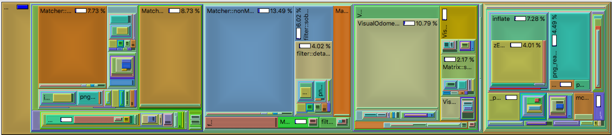

# EE109 Digital System Lab Final Report
Connor Normand, Pranav Padode

## Table of Contents
- Application Overview
- Software Simulation
- Hardware Implementation
- Design Tradeoffs
- Appendix

## Application Overview
- The aim of our project is to find ways to push very computationally-expensive computer vision tasks to hardware 
accelerators and improving performance numbers to completion. We are specifically interested in implementing a 
stereoscopic visual odometry system. This visual odometry system utilizes a set of pairs of images from two cameras to calculate a 6 DOF matrix that represents a change in position.

## Software Simulation 
- The visual odometry system that we are using is called libviso2 and is built on pure C++ with no external dependencies. The library implements normalization of images, feature matching, RANSAC and kalman-filtering to give a 6 DOF matrix that gives the change in position.

- [Libviso2 Link](http://www.cvlibs.net/software/libviso/) 

- When libviso2 was profiled, we found that a number of select functions represented the majority of the runtime, the two that we chose to focus on represented ~24& of all time spent inside of libviso2. These functions were nonMaximumSuppression and computeResidualsAndJacobian.



- When processing the runtime of libviso2, we chose to use the <chrono> package in the C++ software simulation to benchmark our progress in optimization. In our recordings, we found that the function nonMaximumSuppression took ~20.3 ms to process. Our goal moving forward was to bring this runtime down through hardware acceleration.

```
Example Output:
Processing: Frame: 28
Time taken by function: 16 milliseconds
Time taken by function: 24 milliseconds
Time taken by function: 17 milliseconds
Time taken by function: 24 milliseconds
Processing: Frame: 29
Time taken by function: 18 milliseconds
Time taken by function: 28 milliseconds
Time taken by function: 18 milliseconds
Time taken by function: 21 milliseconds
Processing: Frame: 30
Time taken by function: 17 milliseconds
Time taken by function: 24 milliseconds
Time taken by function: 14 milliseconds
Time taken by function: 23 milliseconds
Processing: Frame: 31
Time taken by function: 16 milliseconds
Time taken by function: 27 milliseconds
Time taken by function: 17 milliseconds
Time taken by function: 23 milliseconds
Processing: Frame: 32
Time taken by function: 18 milliseconds
Time taken by function: 29 milliseconds
Time taken by function: 16 milliseconds
Time taken by function: 29 milliseconds
Processing: Frame: 33
Time taken by function: 18 milliseconds
Time taken by function: 26 milliseconds
Time taken by function: 18 milliseconds
Time taken by function: 23 milliseconds
Processing: Frame: 34
Time taken by function: 17 milliseconds
Time taken by function: 27 milliseconds
Time taken by function: 18 milliseconds
Time taken by function: 24 milliseconds
Processing: Frame: 35
Time taken by function: 20 milliseconds
Time taken by function: 25 milliseconds
Time taken by function: 16 milliseconds
Time taken by function: 25 milliseconds
Processing: Frame: 36
Time taken by function: 18 milliseconds
Time taken by function: 26 milliseconds
Time taken by function: 17 milliseconds
Time taken by function: 21 milliseconds
Processing: Frame: 37
Time taken by function: 18 milliseconds
Time taken by function: 31 milliseconds
Time taken by function: 16 milliseconds
Time taken by function: 26 milliseconds
Processing: Frame: 38
Time taken by function: 19 milliseconds
Time taken by function: 24 milliseconds
Time taken by function: 17 milliseconds
Time taken by function: 20 milliseconds
```

## Hardware Implementation
- The driving function of the hardware implementation of nonMaximumSuppression (Full test function located in Milestone 2) is replicated here:

```scala
  @virtualize
  def nms(image: Matrix[T], image_2: Matrix[T], n: Int, tau: Int, margin: Int): Tensor4[T] = {
    val H = ArgIn[Int]
    val W = ArgIn[Int]
	val N = ArgIn[Int]
	val M = ArgIn[Int]
	val TAU = ArgIn[Int]
	
    setArg(H, image.rows)
    setArg(W, image.cols)
	setArg(N, n)
	setArg(M, margin)
	setArg(TAU, tau)
    val lb_par = 8

    val img = DRAM[T](W, H)
    val img_2 = DRAM[T](W, H)
    val imgOut = DRAM[T](W, H)
	val maximaOut = DRAM[Int](W, H, 4, 4)

    setMem(img, image)
    setMem(img_2, image_2)

    Accel {

	  // initialize and parallelize initial loops
	  val i_start = N + M 
	  val i_end = W - N- M
	  val i_step = N + 1

	  val j_start = N + M
	  val j_end = H - N - M
	  val j_step = N + 1

	  val img_mem = SRAM[T](Width, Height)
	  val img_mem_2 = SRAM[T](Width, Height)
	  img_mem load img(0::W, 0::H)
	  img_mem_2 load img_2(0::W, 0::H)

	  Sequential.Foreach(i_start until i_end by i_step){i =>
	    Sequential.Foreach(j_start until j_end by j_step){j =>
		  val f1mini = Reg[T]
		  val f1maxi = Reg[T]
		  val f2mini = Reg[T]
		  val f2maxi = Reg[T]
		  f1mini := i.to[T]
		  f1maxi := i.to[T]
		  f2mini := i.to[T]
		  f2maxi := i.to[T]

		  val f1minj = Reg[T]
		  val f1maxj = Reg[T]
		  val f2minj = Reg[T]
		  val f2maxj = Reg[T]

		  f1minj := j.to[T]
		  f1maxj := j.to[T]
		  f2minj := j.to[T]
		  f2maxj := j.to[T]

		  val f1minval = Reg[T]
		  val f1maxval = Reg[T]
		  f1minval := img_mem(i, j)
		  f1maxval := f1minval
		
		  val f2minval = Reg[T]
		  val f2maxval = Reg[T]
		  f2minval := img_mem_2(i, j)
		  f2maxval := f2minval

		  // Starting inner loop
	      val i2_start = Reg[Int]
	      val i2_end = Reg[Int]
	      val i2_step = Reg[Int]

	      val j2_start = Reg[Int]
	      val j2_end = Reg[Int]
	      val j2_step = Reg[Int]

	      i2_start := i
	      i2_end := i + N
	      i2_step := 1

	      j2_start := j
	      j2_end := j + N
	      j2_step := 1

		  // Must set thexe parallelization factors correctly prior to running
		  val i2_par = 3
		  val j2_par = 3

		  Foreach(i2_start until i2_end by i2_step par i2_par){ii =>
		    Foreach(j2_start until j2_end by j2_step par j2_par){jj =>
				val curr = Reg[Int]
				curr := img_mem(ii, jj) 
				if (curr < f1minval) {
					f1mini := ii
					f1minj := jj
					f1minval := curr	
				} else if (curr > f1maxval) {
					f1maxi := ii
					f1maxj := jj
					f1maxval := curr
				}
				val curr_2 = Reg[Int]
				curr_2 := img_mem_2(ii, jj)
				if (curr_2 < f2minval) {
					f2mini := ii
					f2minj := jj
					f2minval := curr
				} else if (curr_2 > f2maxval) {
					f2mini := ii
					f2maxj := jj
					f2maxval := curr
				}
		    }
		  }

		  val tile = SRAM[Int](4, 4)
		  tile.par(4)

		  if (f1minval.value.to[Int] <= -TAU) {
			Foreach(0::4 par 4){i_index =>
			  if (i_index == 0)
				tile(i_index, 0) = f1mini
			  else if (i_index == 1)
				tile(i_index, 0) = f1minj
			  else if (i_index == 2)
				tile(i_index, 0) = f1minval
			  else
				tile(i_index, 0) = 0
			}
		  } else {
			Foreach(0::4){i_index =>
			  tile(i_index, 0) = 0
			}
		  }
			if (f1maxval.value.to[Int] >= TAU) {
			  Foreach(0::4){i_index =>
			    if (i_index == 0)
			  	  tile(i_index, 1) = f1maxi
			    else if (i_index == 1)
				  tile(i_index, 1) = f1maxj
			    else if (i_index == 2)
				  tile(i_index, 1) = f1maxval
			    else
				  tile(i_index, 1) = 1
			  }
			} else {
			  Foreach(0::4){i_index =>
			    tile(i_index, 0) = 0
			  }
			}

			if (f2minval.value.to[Int] <= -TAU) {
			  Foreach(0::4){i_index =>
			    if (i_index == 0)
			  	  tile(i_index, 2) = f2mini
			    else if (i_index == 1)
				  tile(i_index, 2) = f2minj
			    else if (i_index == 2)
				  tile(i_index, 2) = f2minval
			    else
				  tile(i_index, 2) = 2
			  }
			} else {
			  Foreach(0::4){i_index =>
			    tile(i_index, 0) = 0
			  }
			}

			if (f2maxval.value.to[Int] >= TAU) {
			  Foreach(0::4){i_index =>
			    if (i_index == 0)
			  	  tile(i_index, 3) = f2maxi
			    else if (i_index == 1)
				  tile(i_index, 3) = f2maxj
			    else if (i_index == 2)
				  tile(i_index, 3) = f2maxval
			    else
				  tile(i_index, 3) = 3
			  }
			} else {
			  Foreach(0::4){i_index =>
			    tile(i_index, 0) = 0
			  }
			}
		
			maximaOut(j, i, 0::4 par 4, 0::4 par 4) store tile
		  }
		  // End first parallelization

	  // End overall loop
	  }

    }

    getTensor4(maximaOut)
  }
```

- Which when run on the board, we receive a runtime/cycle count of

```
Design done, ran for 5.592713 ms, status = 00000001
Kernel done, test run time = 0 ms
[memcpy] dummyBuf = 0x95893008, (phys = 0), arraySize = 247455752
[memcpy] dummyBuf = 0x95893008, dummyBuf[2621439] = 0
  x14605 - 566298 (566298 / 0) [0 iters/parent execution]
    x13280 - 40968 (40968 / 1) [1 iters/parent execution]
      x13241 - 17 (6028 / 335) [335 iters/parent execution]
      x13279 - 121 (40630 / 335) [335 iters/parent execution]
        x13259 - 7 (2679 / 335) [1 iters/parent execution]
        x13278 - 111 (37194 / 335) [1 iters/parent execution]
    x13383 - 40962 (40962 / 1) [1 iters/parent execution]
      x13344 - 17 (6028 / 335) [335 iters/parent execution]
      x13382 - 121 (40626 / 335) [335 iters/parent execution]
        x13362 - 7 (2679 / 335) [1 iters/parent execution]
        x13381 - 111 (37194 / 335) [1 iters/parent execution]
    x13416 - 6 (6 / 1) [1 iters/parent execution]
    x14604 - 484334 (484334 / 1) [1 iters/parent execution]
      x14603 - 5978 (484219 / 81) [81 iters/parent execution]
        x13498 - 7 (13607 / 1701) [21 iters/parent execution]
        x14282 - 49 (85048 / 1701) [21 iters/parent execution]
          x14281 - 13 (23812 / 1701) [1 iters/parent execution]
            x13762 - 9 (17008 / 1701) [1 iters/parent execution]
              x13580 - 9 (17008 / 1701) [1 iters/parent execution]
                x13560 - 0 (766 / 1701) [1 iters/parent execution]
                x13575 - 1 (2756 / 1701) [1 iters/parent execution]
                x13576 - 7 (13486 / 1701) [1 iters/parent execution]
              x13609 - 9 (17008 / 1701) [1 iters/parent execution]
                x13589 - 0 (716 / 1701) [1 iters/parent execution]
                x13604 - 1 (2792 / 1701) [1 iters/parent execution]
                x13605 - 7 (13500 / 1701) [1 iters/parent execution]
              x13638 - 9 (17008 / 1701) [1 iters/parent execution]
                x13618 - 0 (684 / 1701) [1 iters/parent execution]
                x13633 - 1 (2828 / 1701) [1 iters/parent execution]
                x13634 - 7 (13496 / 1701) [1 iters/parent execution]
              x13703 - 9 (17008 / 1701) [1 iters/parent execution]
                x13683 - 0 (762 / 1701) [1 iters/parent execution]
                x13698 - 1 (3386 / 1701) [1 iters/parent execution]
                x13699 - 7 (12860 / 1701) [1 iters/parent execution]
              x13732 - 9 (17008 / 1701) [1 iters/parent execution]
                x13712 - 0 (714 / 1701) [1 iters/parent execution]
                x13727 - 2 (3424 / 1701) [1 iters/parent execution]
                x13728 - 7 (12870 / 1701) [1 iters/parent execution]
              x13761 - 9 (17008 / 1701) [1 iters/parent execution]
                x13741 - 0 (692 / 1701) [1 iters/parent execution]
                x13756 - 2 (3448 / 1701) [1 iters/parent execution]
                x13757 - 7 (12868 / 1701) [1 iters/parent execution]
            x14021 - 9 (17008 / 1701) [1 iters/parent execution]
              x13839 - 9 (17008 / 1701) [1 iters/parent execution]
                x13819 - 0 (1132 / 1701) [1 iters/parent execution]
                x13834 - 3 (5853 / 1701) [1 iters/parent execution]
                x13835 - 5 (10023 / 1701) [1 iters/parent execution]
              x13868 - 9 (17008 / 1701) [1 iters/parent execution]
                x13848 - 0 (1140 / 1701) [1 iters/parent execution]
                x13863 - 3 (5880 / 1701) [1 iters/parent execution]
                x13864 - 5 (9988 / 1701) [1 iters/parent execution]
              x13897 - 9 (17008 / 1701) [1 iters/parent execution]
                x13877 - 0 (1140 / 1701) [1 iters/parent execution]
                x13892 - 3 (5916 / 1701) [1 iters/parent execution]
                x13893 - 5 (9952 / 1701) [1 iters/parent execution]
              x13962 - 9 (17008 / 1701) [1 iters/parent execution]
                x13942 - 0 (992 / 1701) [1 iters/parent execution]
                x13957 - 3 (6565 / 1701) [1 iters/parent execution]
                x13958 - 9451 (9451 / -1161889074) [-683062 iters/parent execution]
              x13991 - 0 (0 / 3) [0 iters/parent execution]
                x13971 - 31 (93 / 3) [1 iters/parent execution]
                x13986 - 16 (335 / 20) [6 iters/parent execution]
                x13987 - 1 (268684800 / 268435456) [89478485 iters/parent execution]
              x14020 - 0 (268560128 / 268809472) [158030 iters/parent execution]
                x14000 - 566298 (566298 / 0) [0 iters/parent execution]
                x14015 - 40968 (40968 / 1) [0 iters/parent execution]
                x14016 - 17 (6028 / 335) [0 iters/parent execution]
            x14280 - 121 (40630 / 335) [0 iters/parent execution]
              x14098 - 7 (2679 / 335) [1 iters/parent execution]
                x14078 - 111 (37194 / 335) [1 iters/parent execution]
                x14093 - 40962 (40962 / 1) [0 iters/parent execution]
                x14094 - 17 (6028 / 335) [1 iters/parent execution]
              x14127 - 121 (40626 / 335) [1 iters/parent execution]
                x14107 - 7 (2679 / 335) [1 iters/parent execution]
                x14122 - 111 (37194 / 335) [1 iters/parent execution]
                x14123 - 6 (6 / 1) [0 iters/parent execution]
              x14156 - 484334 (484334 / 1) [0 iters/parent execution]
                x14136 - 5978 (484219 / 81) [81 iters/parent execution]
                x14151 - 7 (13607 / 1701) [1701 iters/parent execution]
                x14152 - 49 (85048 / 1701) [1701 iters/parent execution]
              x14221 - 13 (23812 / 1701) [5 iters/parent execution]
                x14201 - 9 (17008 / 1701) [1 iters/parent execution]
                x14216 - 9 (17008 / 1701) [1 iters/parent execution]
                x14217 - 0 (766 / 1701) [1 iters/parent execution]
              x14250 - 1 (2756 / 1701) [5 iters/parent execution]
                x14230 - 7 (13486 / 1701) [1 iters/parent execution]
                x14245 - 9 (17008 / 1701) [1 iters/parent execution]
                x14246 - 0 (716 / 1701) [1 iters/parent execution]
              x14279 - 1 (2792 / 1701) [5 iters/parent execution]
                x14259 - 7 (13500 / 1701) [1 iters/parent execution]
                x14274 - 9 (17008 / 1701) [1 iters/parent execution]
                x14275 - 0 (684 / 1701) [1 iters/parent execution]
        x14299 - 1 (2828 / 1701) [21 iters/parent execution]
        x14320 - 7 (13496 / 1701) [21 iters/parent execution]
          x14313 - 9 (17008 / 1701) [1 iters/parent execution]
            x14312 - 0 (762 / 1701) [1 iters/parent execution]
          x14319 - 1 (3386 / 1701) [1 iters/parent execution]
            x14318 - 7 (12860 / 1701) [1 iters/parent execution]
        x14335 - 9 (17008 / 1701) [21 iters/parent execution]
        x14356 - 0 (714 / 1701) [21 iters/parent execution]
          x14349 - 2 (3424 / 1701) [1 iters/parent execution]
            x14348 - 7 (12870 / 1701) [1 iters/parent execution]
          x14355 - 9 (17008 / 1701) [1 iters/parent execution]
            x14354 - 0 (692 / 1701) [1 iters/parent execution]
        x14372 - 2 (3448 / 1701) [21 iters/parent execution]
        x14393 - 7 (12868 / 1701) [21 iters/parent execution]
          x14386 - 9 (17008 / 1701) [1 iters/parent execution]
            x14385 - 9 (17008 / 1701) [1 iters/parent execution]
          x14392 - 0 (1132 / 1701) [1 iters/parent execution]
            x14391 - 3 (5853 / 1701) [1 iters/parent execution]
        x14408 - 5 (10023 / 1701) [21 iters/parent execution]
        x14429 - 9 (17008 / 1701) [21 iters/parent execution]
          x14422 - 0 (1140 / 1701) [1 iters/parent execution]
            x14421 - 3 (5880 / 1701) [1 iters/parent execution]
          x14428 - 5 (9988 / 1701) [1 iters/parent execution]
            x14427 - 9 (17008 / 1701) [1 iters/parent execution]
        x14432 - 0 (1140 / 1701) [21 iters/parent execution]
        x14602 - 3 (5916 / 1701) [21 iters/parent execution]
          x14594 - 5 (9952 / 1701) [1 iters/parent execution]
            x14518 - 9 (17008 / 1701) [1 iters/parent execution]
            x14593 - 0 (992 / 1701) [1 iters/parent execution]
          x14601 - 3 (6565 / 1701) [1 iters/parent execution]
```

- As we can see, elaborating the design took more overall time than the software simulation. The elaboration time for the board is around 5.6 ms, which is about 27.5% of the runtime for the software simulation.

- The logic utilization is shown below

```
Logic utilization (in ALMs) : 54,959 / 251,680 ( 22 % )
Total registers : 83568
Total pins : 145 / 812 ( 18 % )
Total virtual pins : 0
Total block memory bits : 7,814,912 / 43,642,880 ( 18 % )
Total RAM Blocks : 496 / 2,131 ( 23 % )
Total DSP Blocks : 10 / 1,687 ( < 1 % )
Total HSSI RX channels : 0 / 48 ( 0 % )
Total HSSI TX channels : 0 / 48 ( 0 % )
Total PLLs : 50 / 96 ( 52 % )
```

## Design Tradeoffs
#### Parallelization
- Throughtout the whole design process, we wanted to focus on parallelization as a primary method of optimizing runtime. In nonMaximumSuppression, we see the parallelization factors in a number of Foreach loops. This nonMaximumSuppression algorithm is allowed to be parallelized to a great extent. The implementation takes in two image matrices and performs nonMaximumSuppression iteratively through the matrix, analyzing the surrounding N pixels. Because each iteration doesn't modify the image matrix or interfere with other iteration's data, we are able to parallelize a major component of this function into a single cycle. Other parallelizations focus on writing in data into tiles and then loading it into maximaOut to be returned.

#### Focusing on the Common Case
- To determine the final i, j, and val parameters to be returned, the nonMaximumSuppression algorithm implemented in matcher.cpp in libviso2 has to reiterate throught the NxN bounding boxes determed by the previous loops in order to trim the output vectors. We found that it was much easier to disregard these values later in the program by designating them sentinal values of 0 for every index and disposing of those returned maxima.

## Appendix
```
// If you have any comments about the class, or have a video you want to show us, 
// feel free to add them in the Appendix.
```
